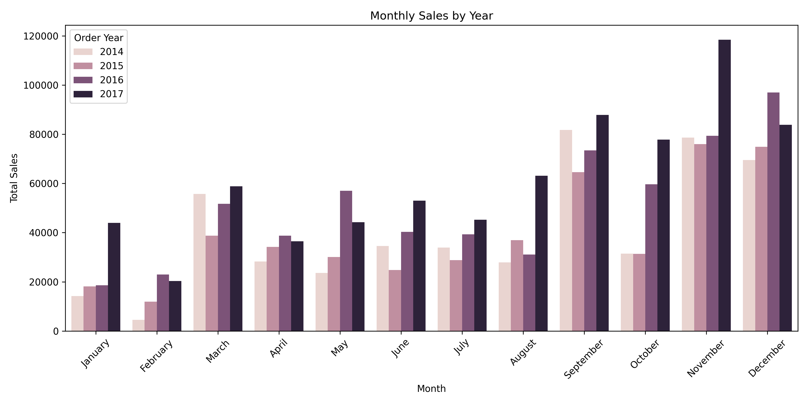
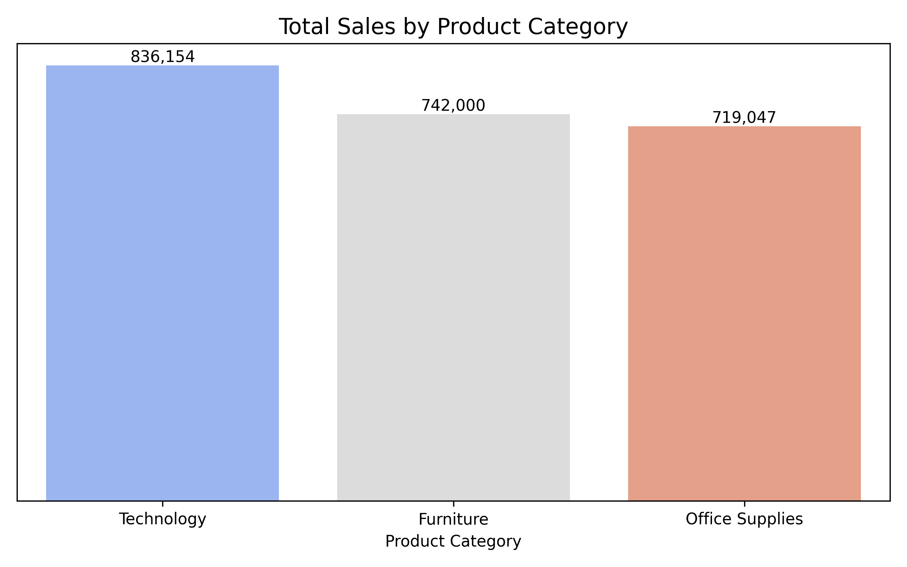
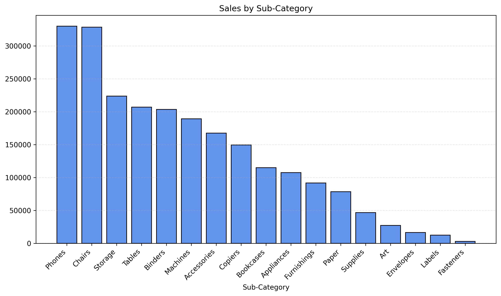
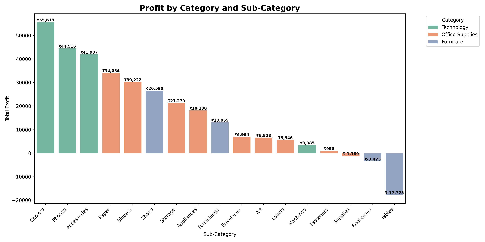
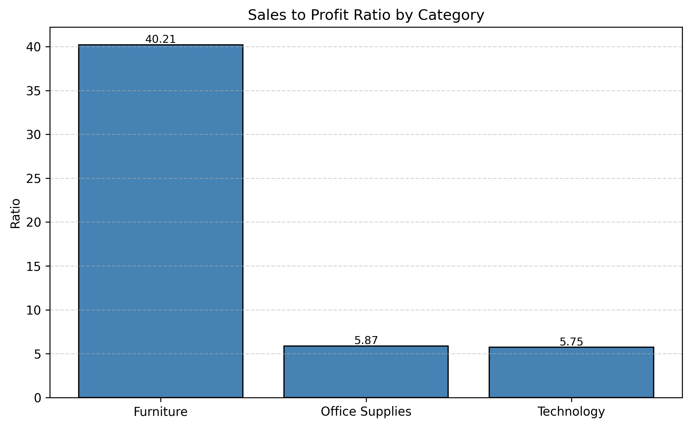
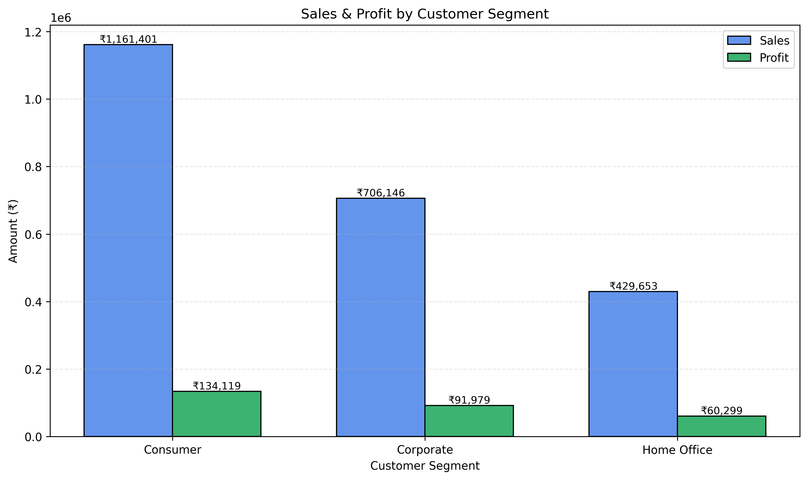

<div align="center">

# 📊 E-Commerce Sales Analysis — Python

**Exploratory Data Analysis on 9,994 retail orders (2014–2017) using Pandas, Matplotlib & Seaborn**


</div>

---

## 📌 Overview

This project digs into the classic **Sample Superstore** dataset to answer real business questions — which months sell the most, which product categories actually make money, and which customer segments are the most efficient. It's a full EDA workflow: cleaning, feature engineering (date parsing, month/year extraction), grouping, aggregating, and visualizing — all built from scratch in a Jupyter Notebook.

| | |
|---|---|
| 🗂️ **Rows analyzed** | 9,994 orders |
| 📅 **Time span** | Jan 2014 – Dec 2017 |
| 🌎 **Region** | United States (4 regions) |
| 🏷️ **Categories** | Furniture, Office Supplies, Technology |
| 💰 **Total Sales** | ₹22,97,200 |
| 📈 **Total Profit** | ₹2,86,397 |

---

## 🛠️ Tech Stack

- **Python** — Pandas, NumPy
- **Visualization** — Matplotlib, Seaborn
- **Environment** — Jupyter Notebook

---

## ❓ Business Questions Answered

| # | Question |
|---|---|
| 1 | Which month had the highest and lowest sales overall? |
| 2 | Which product category has the highest vs. lowest sales? |
| 3 | How do sales break down by sub-category? |
| 4 | Which month had the highest profit? |
| 5 | Which sub-category is most / least profitable? |
| 6 | How do sales, profit & profit margin compare across customer segments? |
| 7 | What's the sales-to-profit ratio for each category? |

---

## 🔍 Key Insights

### 1. Sales peak hard in Q4, and February is the dead zone every year

November brought in the highest total sales (₹3,52,461) across all four years combined, while February was consistently the weakest month (₹59,751) — this dip shows up almost every single year, not just once.

### 2. Technology sells the most, but the margins tell a different story

Technology leads total sales (₹8,36,154), just ahead of Furniture (₹7,42,000) and Office Supplies (₹7,19,047) — but raw sales don't tell you who's actually profitable (see below).

### 3. Phones and Chairs sell the most, but Copiers make the most money


Phones (₹3,30,007) and Chairs (₹3,28,449) top the sales charts. But when you look at profit, **Copiers** — a much smaller sales line — actually generates the most profit (₹55,618), followed by Phones and Accessories.

### 4. Tables are quietly losing money
Tables post solid sales but end up **-₹17,725 in losses**, the worst of any sub-category — Bookcases and Supplies are also mildly unprofitable. This is the kind of thing you'd only catch by looking at profit separately from sales.

### 5. Furniture converts sales to profit far less efficiently

Furniture has a sales-to-profit ratio of **40.21** — meaning it takes ₹40 of furniture sales to generate ₹1 of profit. Compare that to Office Supplies (5.87) and Technology (5.75). Heavy discounting on big-ticket items like tables and bookcases is the likely culprit.

### 6. Home Office customers are the smallest segment but the most efficient

Consumers drive the most revenue (₹11,61,401) but Home Office customers have the best profit margin (14.03%) vs. Consumer (11.55%) and Corporate (13.03%) — smaller segment, but a more efficient one.

### 7. December quietly beats November on profit
Even though November wins on raw sales, **December is the single highest-profit month** (₹43,369) — suggesting different discount behavior between the two months.

---

## 📁 Repository Structure

```
├── ECommerce_Sales_Python_Project.ipynb      # full analysis notebook
├── ECommerce_Sales_Python_Project.pdf        # exported notebook (view without Jupyter)
├── Sample_-_Superstore_XL_Data.csv           # dataset used
├── category_sales_with_labels.png
├── monthly_sales_by_year.png
├── total_monthly_sales_all_years.png
├── monthly_profit_chart.png
├── sub_category_sales_chart.png
├── profit_by_category_subcategory.png
├── segment_sales_profit.png
├── sales_profit_by_segment_combined.png
├── sales_to_profit_ratio_by_category.png
└── README.md
```

---

## 🚀 How to Run

```bash
# Clone the repo
git clone https://github.com/RishiMishra06/ecommerce-sales-analysis-python.git
cd ecommerce-sales-analysis-python

# Install dependencies
pip install pandas numpy matplotlib seaborn

# Launch Jupyter and run all cells
jupyter notebook ECommerce_Sales_Python_Project.ipynb
```

---

## 📊 Dataset

Used the well-known **Sample Superstore** dataset — a US-based retail dataset with order-level detail across Furniture, Office Supplies, and Technology categories, widely used for practicing sales and profitability analysis.

---

## 👤 Author

**Rishi Mishra**

If you found this useful, a ⭐ on the repo is always appreciated!
